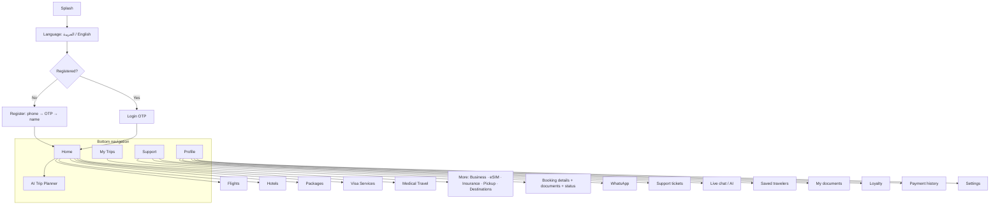
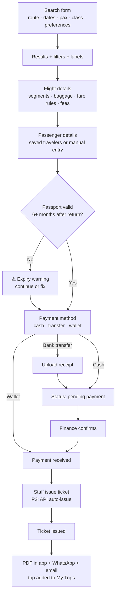
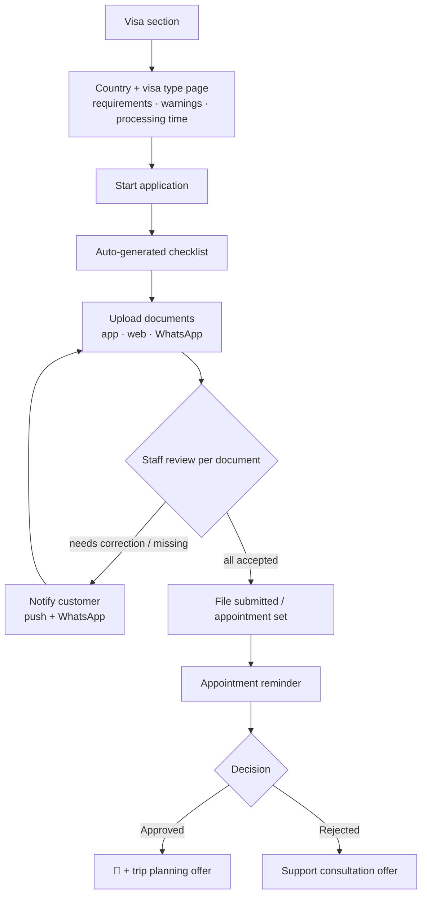
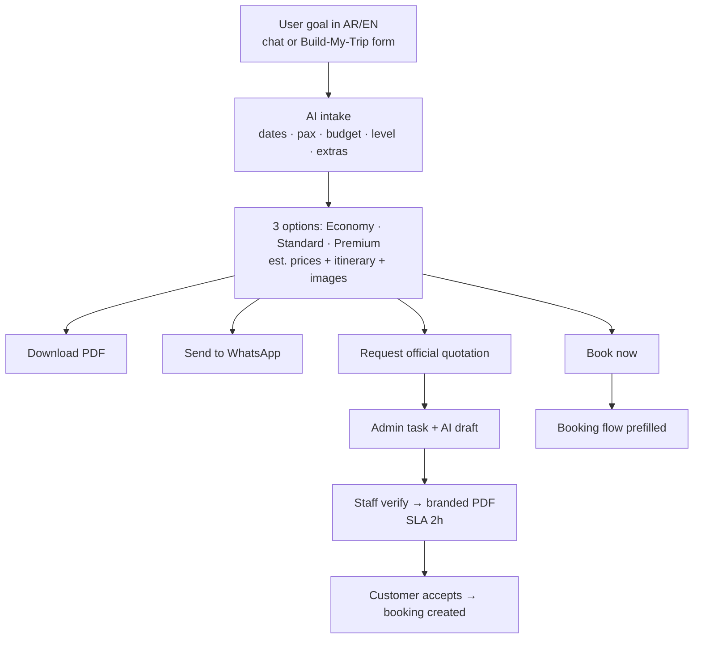
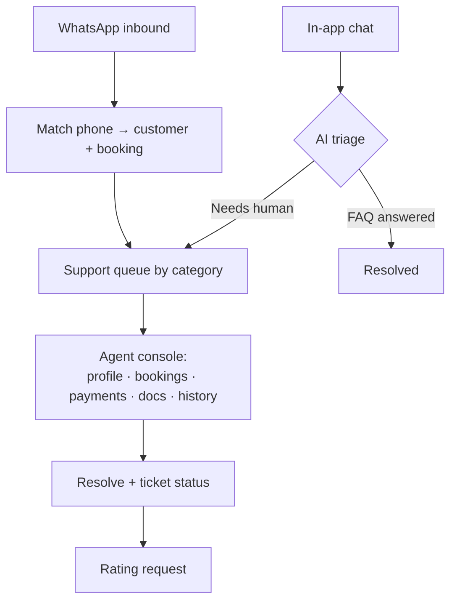
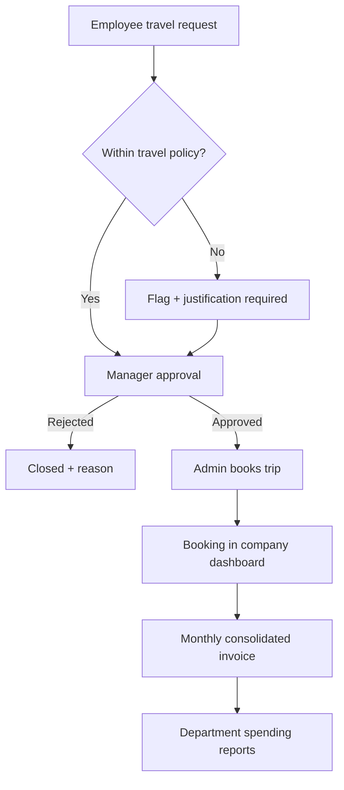
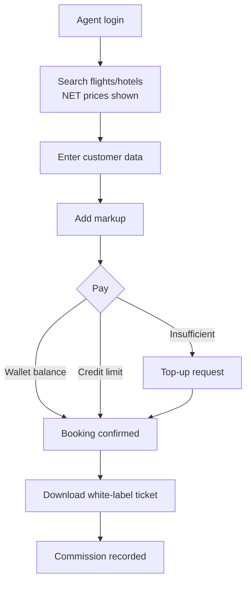

# App Flow Diagrams

Mermaid — renders directly on GitHub.

## 1. App map (mobile)

## 2. Flight booking flow (MVP)

## 3. Visa application flow

## 4. AI trip planner flow

## 5. Support & WhatsApp routing

## 6. Corporate approval flow

## 7. Agent booking flow

