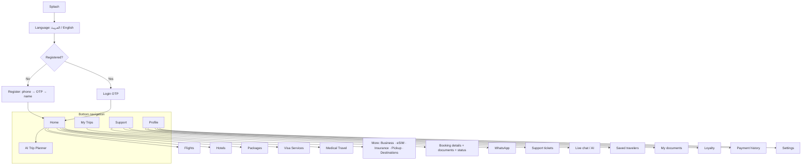
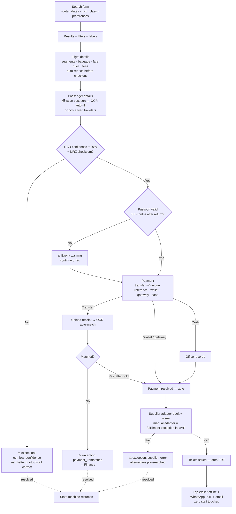
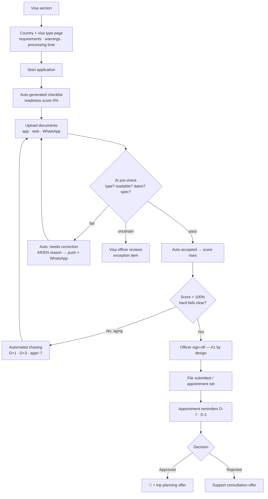
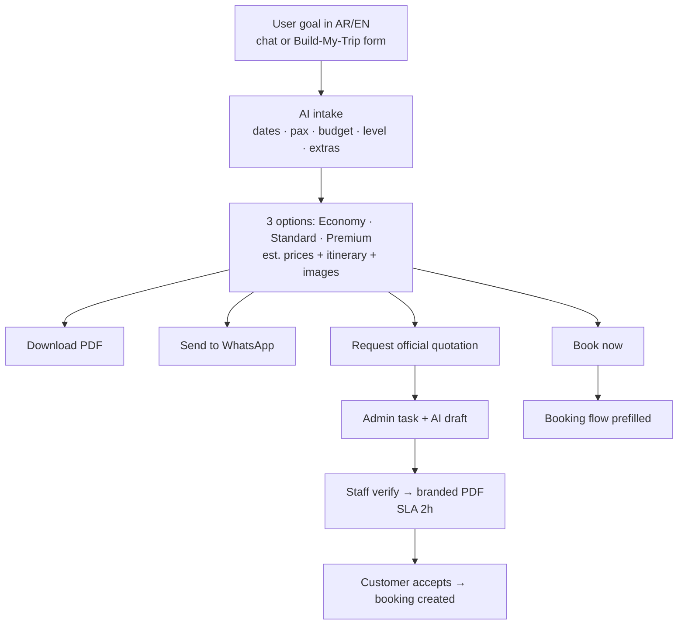
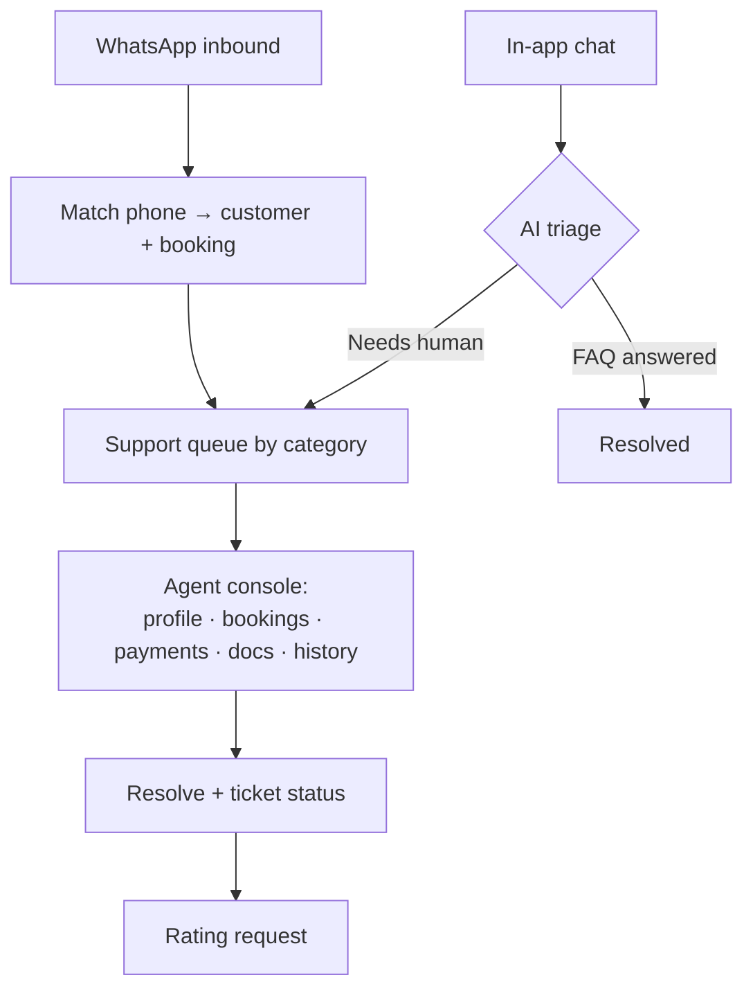
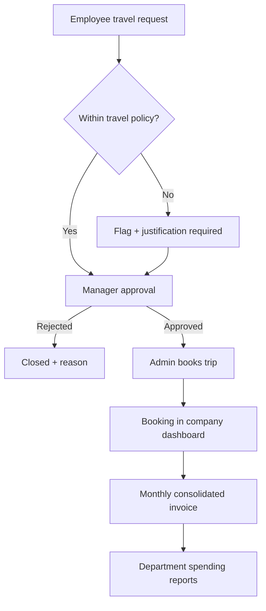
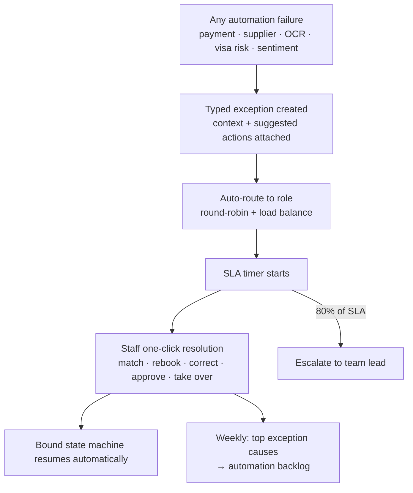
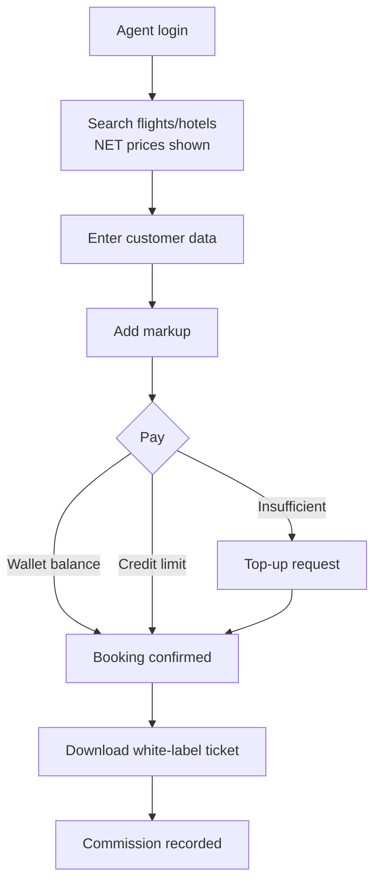

# App Flow Diagrams

Mermaid — renders directly on GitHub.

## 1. App map (mobile)

## 2. Flight booking flow — automated green path

## 3. Visa application flow — AI pre-check + readiness score

## 4. AI trip planner flow

## 5. Support & WhatsApp routing

## 6. Corporate approval flow

## 7. Exception queue — the only staff work surface

## 8. Agent booking flow

