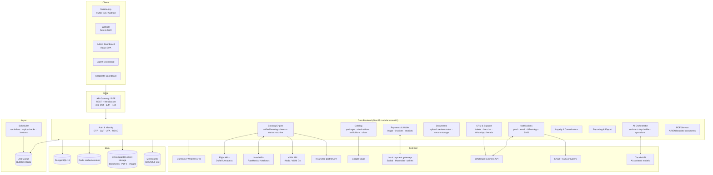
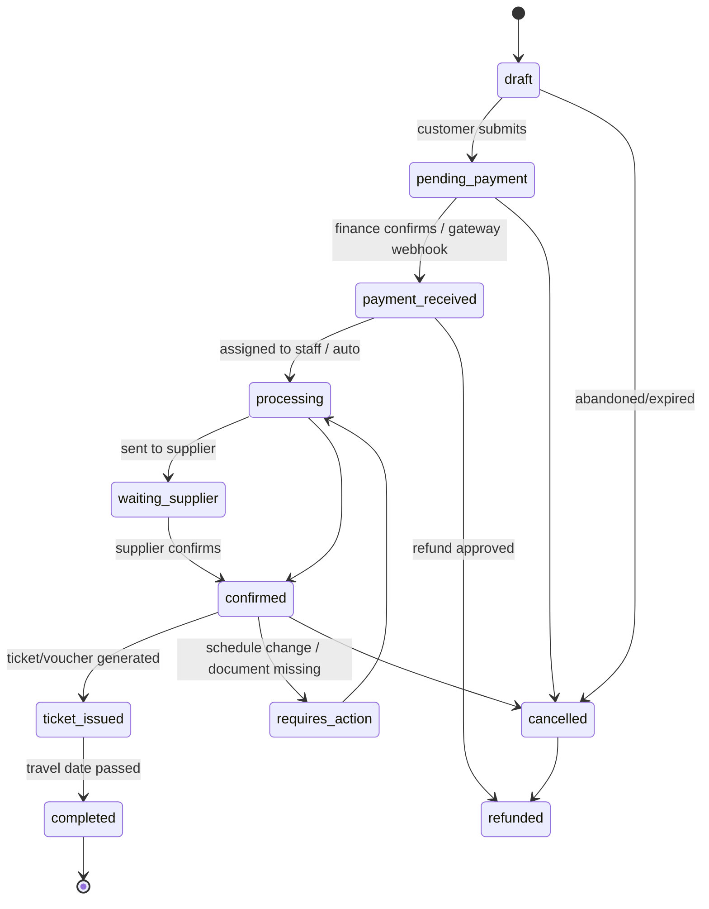
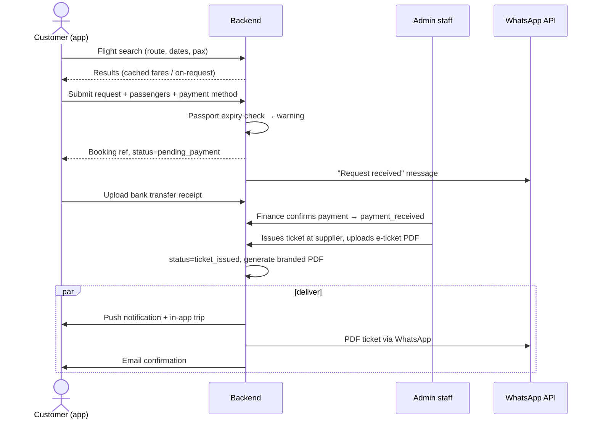

# 4 — System Architecture

## 4.1 High-level architecture

## 4.2 Key architectural decisions

| Decision | Choice | Why |
|---|---|---|
| Backend shape | **Modular monolith** (NestJS), module-per-domain, extractable later | Small team, fast iteration, one deployment; clean module boundaries allow extracting AI/PDF/notifications into services when scale demands |
| Booking model | **Unified `bookings` + polymorphic `booking_items`** | Flights, hotels, visas, eSIM, transfers, packages all share one lifecycle, one payment ledger, one PDF/notification pipeline |
| Fulfillment | **Supplier-adapter pattern** | `ManualFulfillment` adapter in MVP; `DuffelAdapter`, `RateHawkAdapter`, `AiraloAdapter` plug into the same interface in Phase 2 — no dependency on a single supplier |
| Status handling | **Explicit state machine** per booking item with audit trail | The user requirement "status is always visible/truthful" demands guarded transitions + `status_history` |
| Money | **Double-entry ledger** (`ledger_entries`) for wallets, agent balances, commissions | Cash/transfer/wallet mixes and agent credit limits need auditable accounting from day one |
| i18n | Locale in every content table (`_ar` / `_en` columns or translation table); ICU messages in clients | Arabic-first requirement; PDFs and WhatsApp templates also templated per locale |
| Files | Pre-signed S3 URLs, private buckets, AV scan on upload | Passports and medical reports are highly sensitive |
| Realtime | WebSocket (chat, booking status) + FCM push | Live chat + status updates |
| AI | Dedicated orchestrator module with **tool-calling** into internal APIs (search, packages, visa KB, quotation) | The assistant must act, not just chat — and stay inside guardrails |

## 4.3 Booking lifecycle state machine

Rules: transitions only via service layer (never raw updates); each transition writes `status_history` (who, when, note) and fires notification events.

## 4.4 Request flow — MVP semi-manual flight booking

Phase 2 replaces the two staff steps with supplier-adapter API calls; everything else is unchanged.

## 4.5 AI orchestrator (summary — full design in [11-ai-assistant.md](11-ai-assistant.md))

- Claude API with **tool use**: `search_flights`, `search_hotels`, `list_packages`, `get_visa_requirements`, `create_quotation_request`, `get_destination_guide`, `estimate_budget`.
- RAG over internal knowledge base: visa requirements, FAQs, destination guides, policies (Meilisearch/pgvector).
- Guardrails enforced server-side (not only in the prompt): price responses stamped "estimated" unless sourced from a live fare object; medical/visa answers append human-support handoff; PII never crosses user boundaries (tools are scoped to the authenticated user).

## 4.6 Deployment & operations

- **Runtime:** Docker on a managed VPS/cloud (Hetzner/AWS); staging + production; blue-green or rolling deploys via GitHub Actions CI/CD.
- **Resilience for Libyan connectivity:** app-side request retry queues, small payloads, image CDN with aggressive caching, offline viewing of issued tickets/vouchers (stored locally in app).
- **Backups:** PostgreSQL PITR (WAL archiving) + nightly snapshots; S3 versioning; quarterly restore drills.
- **Observability:** structured logs, Sentry (clients + backend), uptime probes, queue depth alerts.
- **Environments/config:** 12-factor, secrets in a vault, per-env feature flags (e.g., `flights.api_mode = manual|duffel`).
