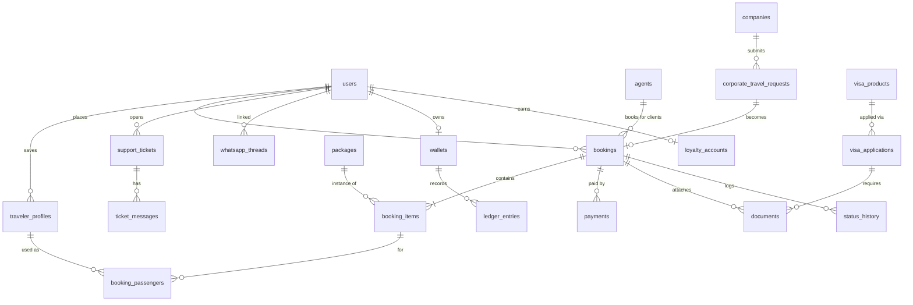

# 5 — Database & Data Model (PostgreSQL)

Conventions: `id UUID PK`, `created_at/updated_at timestamptz` on every table (omitted below), soft-delete via `deleted_at` on user-facing data, money as `numeric(12,2)` + `currency char(3)` (LYD/USD/EUR/TRY), bilingual content as `*_ar` / `*_en` columns.

## 5.1 ER overview (core)



## 5.2 Identity & access

```sql
users (id, phone UNIQUE, email, password_hash, full_name_ar, full_name_en,
       nationality char(2), preferred_locale enum('ar','en'), avatar_url,
       user_type enum('customer','agent_user','corporate_user','staff'),
       phone_verified_at, email_verified_at, two_fa_secret, status,
       marketing_opt_in bool, last_login_at)

roles (id, code UNIQUE, name_ar, name_en)          -- super_admin, booking_manager,
                                                   -- flight_agent, hotel_agent, visa_officer,
                                                   -- medical_officer, support_agent, finance_officer,
                                                   -- marketing_officer, corporate_am, agent_manager
permissions (id, code UNIQUE, description)          -- bookings.read, payments.confirm, refunds.approve ...
role_permissions (role_id FK, permission_id FK)
user_roles (user_id FK, role_id FK)

otp_codes (id, phone, code_hash, purpose, expires_at, consumed_at, attempts)
sessions (id, user_id FK, refresh_token_hash, device_info, ip, expires_at, revoked_at)
audit_logs (id, actor_id FK users, action, entity_type, entity_id, before jsonb, after jsonb, ip)
```

## 5.3 Traveler data

```sql
traveler_profiles (id, owner_user_id FK, relation enum('self','spouse','child','parent','other'),
       first_name, last_name,                -- exactly as in passport (Latin)
       full_name_ar, gender, date_of_birth, nationality char(2),
       passport_number, passport_issue_date, passport_expiry_date,
       passport_country char(2), phone, email, notes)
       -- passport fields encrypted at rest (pgcrypto/app-level)

user_documents (id, user_id FK, traveler_profile_id FK NULL,
       doc_type enum('passport_copy','photo','bank_statement','employment_letter',
                     'invitation_letter','hotel_booking','flight_reservation',
                     'travel_insurance','previous_visa','medical_report','other'),
       file_key, file_name, mime, size_bytes, uploaded_via enum('app','web','whatsapp','staff'),
       review_status enum('received','missing','needs_correction','accepted','rejected','under_review'),
       review_note, reviewed_by FK users, reviewed_at)
```

## 5.4 Unified booking engine

```sql
bookings (id, reference varchar(10) UNIQUE,       -- e.g. RHL-8K2M4
       customer_id FK users, agent_id FK agents NULL, company_id FK companies NULL,
       channel enum('app','web','agent','corporate','staff','ai'),
       status enum('draft','pending_payment','payment_received','processing',
                   'waiting_supplier','confirmed','ticket_issued','requires_action',
                   'completed','cancelled','refunded','failed'),
       currency, subtotal, service_fee, tax, discount, total,
       amount_paid, payment_status enum('unpaid','partial','paid','refunded'),
       assigned_staff_id FK users, source_quotation_id FK quotations NULL, notes_internal)

booking_items (id, booking_id FK, item_type enum('flight','hotel','package','visa','esim',
       'insurance','transfer','medical','business','tour','other'),
       status (same enum as bookings),           -- per-item lifecycle
       title_ar, title_en, service_date_start, service_date_end,
       supplier_id FK suppliers NULL, supplier_ref, cost_price, sell_price, currency,
       details jsonb)                             -- type-specific payload, validated per type:
       -- flight: {segments:[{from,to,dep,arr,airline,flight_no,cabin,baggage}], pnr, fare_rules,
       --          refundable, change_fee, price_confirmed bool}
       -- hotel:  {hotel_name, city, checkin, checkout, rooms:[{type,board,guests}],
       --          free_cancel_until, address, geo:{lat,lng}}
       -- transfer: {airport, flight_no, arrival_time, vehicle_type, hotel, pax, bags, signboard}
       -- esim: {country, data_gb, days, qr_code_key, provider_order_id}

booking_passengers (id, booking_item_id FK, traveler_profile_id FK NULL,
       first_name, last_name, gender, date_of_birth, nationality,
       passport_number, passport_issue_date, passport_expiry_date,
       pax_type enum('adult','child','infant'), ticket_number NULL)

status_history (id, entity_type enum('booking','booking_item','visa_application',
       'support_ticket','payment'), entity_id, from_status, to_status,
       actor_id FK users NULL, actor_type enum('customer','staff','system','supplier'), note)

suppliers (id, name, type enum('gds','hotel_api','esim','insurance','transport',
       'hospital','manual'), adapter_code, contact jsonb, active bool)

flight_search_requests (id, user_id FK NULL, origin, destination, depart_date, return_date,
       trip_type, adults, children, infants, cabin, airline_pref, direct_only,
       flexible_dates bool, results_count, session_id)   -- analytics + abandoned-search reminders
```

## 5.5 Catalog: packages, destinations, exhibitions, visas

```sql
packages (id, slug, type enum('tourism','medical','shopping','family','umrah','visa_assist',
       'business','student','honeymoon','holiday'),
       title_ar, title_en, summary_ar, summary_en, country char(2), city,
       nights int, base_price_pp, currency, includes jsonb, excludes jsonb,
       itinerary jsonb,                          -- [{day:1, title_ar, title_en, body_ar, body_en}]
       hero_image_key, gallery jsonb, options jsonb,   -- optional tours, upgrades
       visa_support bool, active bool, featured bool, valid_from, valid_to)

destinations (id, slug, name_ar, name_en, country char(2),
       about_ar, about_en, best_time_ar, best_time_en, visa_info_ar, visa_info_en,
       est_budget_note, halal_food_ar, halal_food_en, shopping_ar, shopping_en,
       family_tips_ar, family_tips_en, medical_info_ar, medical_info_en,
       gallery jsonb, attractions jsonb, flight_routes jsonb, geo jsonb, active bool)

exhibitions (id, name_ar, name_en, industry, country, city, venue,
       starts_on, ends_on, registration_url, description_ar, description_en,
       suggested_hotels jsonb, visa_product_id FK NULL, active bool)

visa_products (id, country char(2), visa_type enum('tourist','schengen','student','medical',
       'business','exhibition','transit','other'),
       title_ar, title_en, requirements jsonb,   -- checklist items with doc_type mapping
       passport_rules_ar/-en, bank_statement_rules_ar/-en, processing_time_note,
       warnings_ar/-en, service_fee, active bool)

visa_applications (id, booking_item_id FK, visa_product_id FK, applicant_profile_id FK,
       status enum('draft','docs_pending','under_review','submitted','appointment_set',
                   'approved','rejected','cancelled'),
       appointment_at, appointment_place, decision_note, officer_id FK users)

visa_application_documents (id, visa_application_id FK, user_document_id FK,
       checklist_key, review_status, review_note)
```

## 5.6 Medical & business travel

```sql
medical_requests (id, booking_item_id FK NULL, user_id FK,
       destination_country, specialty, preferred_city, hospital_pref,
       needs_translator bool, needs_pickup bool, hotel_near_hospital bool,
       companions int, estimated_cost, status enum('new','reviewing','package_sent',
       'appointment_set','confirmed','completed','cancelled'),
       officer_id FK users, appointment jsonb, notes)
       -- medical reports live in user_documents(doc_type='medical_report')

business_requests (id, booking_item_id FK NULL, user_id FK, company_id FK NULL,
       exhibition_id FK NULL, purpose enum('exhibition','conference','meeting',
       'delegation','factory_visit','supplier_visit'),
       destination, dates jsonb, travelers int, needs jsonb, status, notes)
```

## 5.7 Payments, wallet, invoicing (double-entry)

```sql
payments (id, booking_id FK, method enum('cash_office','bank_transfer','local_card',
       'gateway','mobile_wallet','agent_balance','corporate_invoice','wallet','deposit'),
       direction enum('in','out'),                -- out = refund
       amount, currency, status enum('pending','under_review','confirmed','rejected','refunded'),
       receipt_no UNIQUE, gateway_ref, transfer_receipt_key,  -- uploaded receipt image
       confirmed_by FK users, confirmed_at, note)

wallets (id, owner_type enum('user','agent','company'), owner_id, currency,
       balance numeric(14,2), credit_limit numeric(14,2) DEFAULT 0, status)

ledger_entries (id, wallet_id FK, entry_type enum('topup','booking_charge','refund',
       'commission','cashback','adjustment','invoice_payment'),
       debit, credit, balance_after, reference_type, reference_id, note, created_by)

invoices (id, number UNIQUE, bill_to_type enum('user','agent','company'), bill_to_id,
       booking_id FK NULL, period daterange NULL,   -- monthly corporate invoices
       lines jsonb, subtotal, tax, total, currency,
       status enum('draft','issued','paid','overdue','void'), due_date, pdf_key)

refund_requests (id, booking_id FK, requested_by FK users, reason, amount,
       status enum('requested','approved','rejected','processed'), processed_payment_id FK)
```

## 5.8 Agents & corporate

```sql
agents (id, name, city, license_no, owner_user_id FK users, wallet_id FK,
       commission_scheme jsonb,                  -- per service type: % or flat
       markup_allowed bool, white_label jsonb,   -- logo/name on printed vouchers
       status enum('pending','active','suspended'))
agent_users (agent_id FK, user_id FK, role enum('owner','staff'))
agent_commissions (id, agent_id FK, booking_id FK, base_amount, commission_amount,
       status enum('pending','earned','paid','reversed'), paid_ledger_entry_id FK)

companies (id, name_ar, name_en, tax_id, address, wallet_id FK,
       travel_policy jsonb,                      -- max stars, airlines, approval thresholds
       preferred_hotels jsonb, preferred_airlines jsonb, billing_cycle, status)
company_employees (id, company_id FK, user_id FK NULL, full_name, department,
       grade, email, phone, traveler_profile_id FK, active bool)
corporate_travel_requests (id, company_id FK, employee_id FK, requested_by FK users,
       purpose, destination, dates jsonb, estimate,
       status enum('draft','pending_approval','approved','rejected','booked','cancelled'),
       booking_id FK NULL)
corporate_approvals (id, request_id FK, approver_id FK users, step int,
       decision enum('pending','approved','rejected'), note, decided_at)
```

## 5.9 Support, chat, WhatsApp

```sql
support_tickets (id, number UNIQUE, user_id FK, booking_id FK NULL,
       category enum('flight','hotel','payment','visa_docs','medical','change_cancel',
                     'refund','technical','general'),
       priority enum('low','normal','high','urgent'),
       status enum('open','pending_customer','pending_staff','resolved','closed'),
       assigned_to FK users, resolution_note, sla_due_at)
ticket_messages (id, ticket_id FK, sender_type enum('customer','staff','system'),
       sender_id, body, attachments jsonb, internal bool)   -- internal notes hidden from customer

whatsapp_threads (id, wa_phone, user_id FK NULL, booking_id FK NULL,
       assigned_to FK users NULL, status enum('open','closed'), last_message_at)
whatsapp_messages (id, thread_id FK, direction enum('in','out'), wa_message_id,
       msg_type enum('text','image','document','template','interactive'),
       body, media_key NULL, template_name NULL, status enum('queued','sent',
       'delivered','read','failed'), error)
whatsapp_templates (id, name, locale, category, body, variables jsonb, approved bool)

chat_conversations (id, user_id FK, kind enum('support','ai_assistant'), status)
chat_messages (id, conversation_id FK, role enum('user','assistant','staff','system'),
       body, payload jsonb,                      -- AI: structured trip options, buttons
       tokens_in, tokens_out)
```

## 5.10 Notifications, loyalty, marketing

```sql
notifications (id, user_id FK, type varchar,      -- booking_confirmed, payment_reminder,
       -- doc_missing, passport_expiry, flight_t24, checkin, hotel_checkin, visa_appt,
       -- esim_activation, return_flight, offer, loyalty_update ...
       title_ar, title_en, body_ar, body_en, data jsonb,
       channels jsonb,                            -- {push:sent, email:sent, wa:delivered, sms:skipped}
       read_at, scheduled_for)

device_tokens (id, user_id FK, platform enum('ios','android','web'), token, last_seen_at)

loyalty_accounts (id, user_id FK, tier enum('silver','gold','vip','corporate','agent'),
       points_balance int, lifetime_points int)
loyalty_transactions (id, account_id FK, points int, reason enum('flight','hotel','package',
       'referral','corporate','repeat','redeem','expire','adjust'),
       booking_id FK NULL, expires_at)
referrals (id, referrer_user_id FK, referred_user_id FK, status, reward_points)

promotions (id, code UNIQUE NULL, title_ar/-en, kind enum('percent','flat','service_fee_off'),
       value, applies_to jsonb, min_total, usage_limit, per_user_limit,
       valid_from, valid_to, active bool)
promotion_redemptions (id, promotion_id FK, user_id FK, booking_id FK, amount_saved)
```

## 5.11 Quotations & PDFs

```sql
quotations (id, number UNIQUE, customer_name, user_id FK NULL, created_by FK users,
       source enum('staff','ai_assistant','trip_builder','agent'),
       destination, travel_dates jsonb, travelers int, package_type,
       lines jsonb,                               -- services + prices
       total, currency, validity_date,
       body_ar text, body_en text,                -- AI-generated professional text
       status enum('draft','sent','viewed','accepted','expired','converted'),
       booking_id FK NULL, pdf_ar_key, pdf_en_key, whatsapp_sent_at, email_sent_at)

generated_documents (id, kind enum('ticket','hotel_voucher','quotation','visa_checklist',
       'invoice','receipt','trip_plan','medical_package','business_package','report'),
       locale, entity_type, entity_id, file_key, version int)

trip_plans (id, user_id FK, source enum('ai','manual'), title, destination,
       dates jsonb, travelers jsonb, budget, style enum('economy','comfortable','luxury'),
       interests jsonb, plan jsonb,               -- overview, options, itinerary, docs, notes, map pins
       pdf_key, quotation_id FK NULL)
```

## 5.12 Settings & system

```sql
settings (key PK, value jsonb, updated_by)        -- fees, bank accounts, SLA hours, feature flags
exchange_rates (id, base, quote, rate, fetched_at)
faq_articles (id, category, question_ar/-en, answer_ar/-en, embedding vector NULL) -- AI RAG
banners (id, placement, image_key, title_ar/-en, link, active, sort)
```

## 5.13 Indexing & integrity highlights

- `bookings(reference)`, `bookings(customer_id, status)`, `booking_items(booking_id)`, `payments(booking_id, status)`, `whatsapp_threads(wa_phone)`, `notifications(user_id, read_at)`.
- Partial index for operational queues: `booking_items(status) WHERE status IN ('processing','waiting_supplier','requires_action')`.
- `CHECK (passport_expiry_date > passport_issue_date)`; app-level rule warns when expiry < return date + 6 months.
- Ledger invariant: `balance_after` maintained in a transaction with `SELECT … FOR UPDATE` on the wallet row; wallet balance never derived from anything but the ledger.
- Row-level security (or strict service-layer scoping) so agents/companies only see their own bookings.
