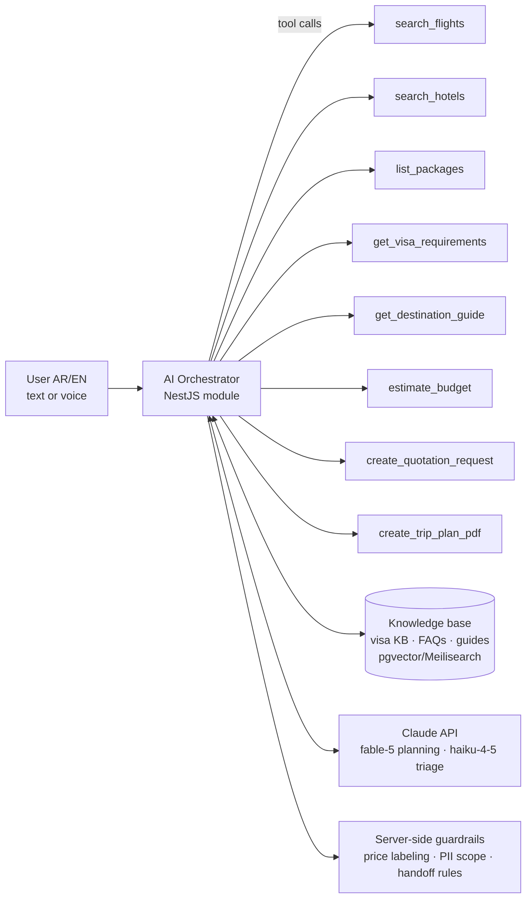

# 11 — AI Travel Assistant Design

Three AI surfaces share one orchestrator: **(A)** customer chat assistant, **(B)** "Build My Trip" planner, **(C)** staff quotation generator.

## 11.1 Architecture

- **Models:** `claude-fable-5` for trip planning, itineraries, quotation writing (quality-critical, Arabic-fluent); `claude-haiku-4-5` for intent triage, FAQ answers, message classification (fast/cheap).
- **Tool-calling, not free generation:** prices, visa checklists, and package data come from internal tools — the model composes and explains; it never invents inventory.
- **Session context:** authenticated user only — saved travelers, past trips, preferences. Tools are scoped server-side to the user's ID; the model cannot query other users.
- **MVP mode:** when live APIs are absent, `search_flights` returns admin-maintained reference fares marked `price_confirmed:false` — every output shows **"سعر تقريبي / Estimated"**.

## 11.2 Conversation design (customer assistant)

**Intake style:** one question per bubble, chips for answers (dates, pax counts, budget bands) so users tap instead of type. Understands Libyan dialect ("نبي نسافر اسطنبول").

**Canonical flow — "I want Istanbul 5 days with my family":**
1. Collect: dates → adults/children → budget band → hotel level → departure city → visa help? → pickup? → eSIM?
2. Generate **3 option cards**: Economy / Standard / Premium. Each card:
   - Flight idea (airline, routing, est. price) · Hotel idea (name, stars, area, est. price)
   - Day-by-day mini program · Estimated total + per person
   - Included ✓ / Not included ✗ lists · destination image strip
   - Buttons: **Request official quotation** · **Book now** · **Send to WhatsApp** · **Download PDF**
3. "Request quotation" → `create_quotation_request` tool → admin task with the AI's draft attached → staff verify prices → official branded PDF sent (SLA 2h).

**Supported intents (launch set):** trip planning, cheapest-flight queries, hotel-near-X (hospital/exhibition/center), visa document questions, package discovery, medical travel routing (→ structured medical intake + human handoff), exhibition trips, honeymoon/family/business packages, budget estimation, general destination Q&A (halal food, weather season, shopping, safety tips).

## 11.3 Guardrails (enforced in code, not just prompt)

| Rule | Enforcement |
|---|---|
| Never confirm final price without live fare object | Response post-processor stamps "estimated" unless payload carries `price_confirmed:true` from a supplier tool |
| No legal/medical guarantees | Medical & visa intents append mandatory handoff block ("فريقنا يتواصل معك — This is guidance, not a guarantee; our team will confirm") |
| Visa answers = document guidance only | Sourced exclusively from internal visa KB (versioned by staff); model may not extrapolate embassy rules |
| PII protection | Tools scoped to authenticated user; logs redacted; no cross-user memory |
| Escalation | "human", anger signals, payment disputes, complex refunds → create support ticket + notify staff, with conversation summary attached |
| Cost control | Token budgets per session; Haiku triage before Fable planning; response caching for destination guides |
| Content | Assistant refuses non-travel requests politely; Arabic/English only |

## 11.4 "Build My Trip" (structured planner)

Form-driven variant of the same engine — for users who prefer taps over chat:
Inputs: departure city · destination (or "اقترح لي / suggest") · purpose · dates · travelers · budget · style (economy/comfortable/luxury) · interests (shopping, medical, family, beach, business, exhibitions, study, honeymoon, adventure) · visa status · language · hotel? pickup? insurance? eSIM?

Output = `trip_plans` record rendered as: overview → flight options → hotel options → daily itinerary → estimated cost table → required documents → important notes → image gallery → map pins → booking buttons → **PDF export** → **WhatsApp share**.

## 11.5 Staff quotation generator

Admin enters: customer name, destination, dates, travelers, package type, price lines, services, notes →
AI produces: professional **Arabic quotation** + **English quotation** (tone: premium travel agency), branded PDF (both locales), ready-to-send WhatsApp message, email body, invoice preview. Staff edit inline before sending; every send recorded on the `quotations` record with status tracking (sent → viewed → accepted → converted).

## 11.6 Images in AI outputs

- Destination/hotel/landmark images served from the **internal curated media library** (licensed + own photography), tagged by destination/theme; AI selects by tag — it never hotlinks arbitrary web images.
- Map previews via Google Static Maps for itinerary stops.
- Every trip plan and package card gets a gallery; PDFs include a hero image + 2–3 inline photos.

## 11.7 Quality process

- Golden-set evaluation: 150 real Libyan-dialect prompts (per intent) scored monthly for correctness, tone, Arabic quality, guardrail compliance.
- Human-review queue: sampled conversations rated by staff; failures feed the KB and prompt updates.
- KB freshness: visa requirement entries carry `verified_at` + owner; assistant cites "updated <date>" on visa answers.
