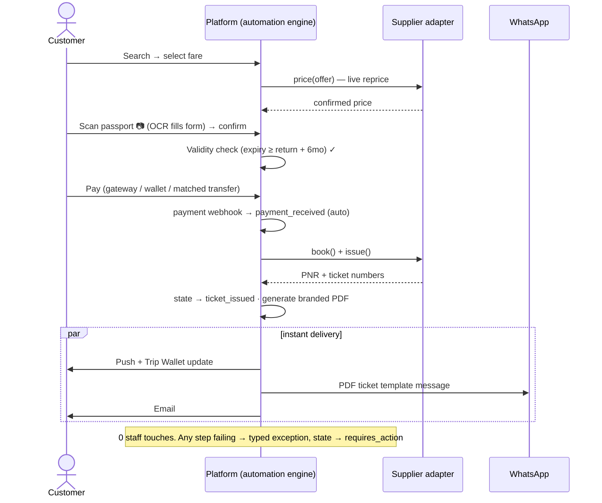

# 12 — Automation-First Operating Model

**The upgrade in one sentence:** same platform, same services, same user types, same phased roadmap — but the default path for every workflow is now **machine-handled end-to-end**, and humans work a single **Exception Queue** instead of processing every booking.

> **Refined by [13-execution-plan-core-mvp.md](13-execution-plan-core-mvp.md)** (authoritative where they differ): expanded 17+16 state model, 17-type exception taxonomy with role routing, recommended starting A-levels, confidence scoring with admin thresholds, mandatory customer confirmation step, Booking Flow Simulator, and the core-backend-first build order.

## 12.1 From travel agency to travel operating system

| | Before (staff-first) | Now (automation-first) |
|---|---|---|
| Normal booking | Staff confirm payment, issue ticket, send PDF | System prices, charges, issues, generates PDF, delivers via app + WhatsApp — **zero touches** |
| Quotation | Staff draft within 2h SLA | AI generates instantly; staff review only flagged cases |
| Passport entry | Customer types 9 fields | **OCR/MRZ scan** fills the form; customer confirms |
| Visa file | Officer reviews every document | AI pre-checks documents; officer reviews only low-confidence or risky files |
| Payment | Finance matches receipts manually | Gateway webhooks + auto-matched transfers; finance sees mismatches only |
| Staff role | Processors of everything | **Exception handlers + relationship managers** |
| North-star ops metric | SLA compliance | **Touchless rate** (% of bookings with zero human touches) + time-to-exception-resolution |

**Design rule for every feature:** *define the green path first (fully automated), then enumerate its failure modes — each failure mode becomes a typed exception, never a manual default.*

## 12.2 Automation levels

Every workflow is classified and configurable (see §12.15 no-code controls):

- **A3 — Touchless:** system decides and acts; humans only see dashboards. *Target for: e-ticket delivery, PDF generation, notifications, eSIM fulfillment, wallet payments, standard quotations.*
- **A2 — Auto with veto:** system acts after a timeout unless staff intervene (e.g., auto-confirm matched bank transfer after 15 min hold). 
- **A1 — Auto-prepared:** system does the work, human clicks approve (e.g., refund calculation, high-value corporate quotes, visa file submission).
- **A0 — Manual:** genuinely human work (medical coordination calls, complaint recovery).

Per-workflow level is a **setting, not code** — the platform launches conservative (more A1/A2) and ratchets toward A3 as confidence grows, without redeployment.

## 12.3 The green path — fully automated booking



## 12.4 The Exception Queue (the only staff work surface)

One queue replaces per-department task lists. Every automation failure creates a **typed, routed, SLA-timed exception** with full context and one-click resolution actions. *(Illustrative subset below — the authoritative 17-type taxonomy and routing table is in [13 §13.3](13-execution-plan-core-mvp.md).)*

| Exception type | Trigger | Routed to | Auto-context attached | Primary actions |
|---|---|---|---|---|
| `payment_unmatched` | Transfer received, no reference match / amount mismatch | Finance | Receipt image, OCR amount, candidate bookings | Match · Request re-upload · Refund |
| `payment_failed` | Gateway decline / timeout | Finance | Gateway error, retry history | Retry · Offer alt method (auto-message) |
| `supplier_error` | book()/issue() failed, price changed, sold out | Booking Manager | Supplier payload, alternative fares pre-searched | Rebook alt · Refund · Contact supplier |
| `ocr_low_confidence` | Passport scan < 90% confidence or MRZ checksum fail | Support | Image + extracted fields diff | Correct fields · Ask new photo (auto-message) |
| `passport_risk` | Expiry < 6mo, name mismatch vs ticket | Booking Manager | Rule that fired, affected pax | Waive · Block + notify |
| `visa_risk` | Readiness score < threshold near appointment; AI flags inconsistent docs | Visa Officer | Score breakdown, flagged docs | Review file · Schedule call |
| `doc_unclassifiable` | WhatsApp/app upload AI can't classify | Visa Officer | Image, AI guess + confidence | Classify · Reject with reason |
| `refund_dispute` | Customer disputes auto-calculated refund | Finance (A1 approval) | Fare rules, auto-calculation | Approve · Adjust · Escalate |
| `medical_case` | Any medical travel request (always human) | Medical Officer | Reports, preferences, AI summary | Assign coordinator |
| `sentiment_alert` | AI detects anger/complaint in chat/WhatsApp | Support lead | Conversation summary | Take over thread |
| `sla_breach_risk` | Any exception aging past 80% of SLA | Team lead | Full trail | Reassign · Escalate |

**Queue mechanics:** auto-assignment round-robin per role with load balancing → SLA timers per type → aging escalation → every resolution feeds a weekly "automation gap" report (top exception causes = next automation backlog). Resolving an exception resumes the state machine where it stopped.

## 12.5 Booking state machine — now the automation backbone

Same states as before ([04-architecture.md](04-architecture.md)); the upgrade is **who drives transitions**:

- Every transition has an `actor_type`: `system` (default), `supplier_webhook`, `customer`, `staff`.
- Timers are first-class: `pending_payment` auto-expires (release fare, notify customer); `waiting_supplier` auto-escalates to `supplier_error` exception after timeout; `confirmed → completed` on trip-end date.
- `requires_action` is now **always bound to an exception record** — it cannot be entered without a typed reason, and clearing the exception auto-returns the booking to its previous flow.
- Guard conditions are declarative rules (see §12.15), e.g. `auto_issue: total < 5000 LYD AND passport_ok AND payment_confirmed`.

## 12.6 Passport OCR & document AI

- **Capture:** in-app camera with MRZ guide overlay (also accepts gallery/WhatsApp images).
- **Extract:** vision model + MRZ parse → name, gender, DOB, nationality, passport no., issue/expiry dates; checksum-validate MRZ digits.
- **Confidence policy:** ≥ 90% + checksum pass → auto-fill, customer confirms (A3). Below → `ocr_low_confidence` exception (A1) with side-by-side correction UI.
- **Auto-actions on save:** create/update `traveler_profiles`, run expiry rule against trip dates, store the image as a `user_documents(passport_copy)` entry — one scan powers booking, visa file, and profile simultaneously.
- **Same engine classifies all uploads:** bank statements, employment letters, insurance, tickets — auto-filed against the right checklist item; unclassifiable → exception.

## 12.7 Visa readiness score — automated file management

- Each checklist item carries a weight; score = Σ(accepted weights) with hard-fail items (passport validity, photo spec) capping the score.
- **AI pre-check on upload (instant):** right document type? readable? dates valid? statement covers 3 months? photo meets spec? → auto-status `accepted`/`needs_correction` with a generated customer-facing reason in AR/EN.
- Officer reviews only: AI-uncertain items, hard-fail overrides, and final file sign-off before submission (A1 by design — visa risk stays human-approved).
- **Automated chasing:** score-driven reminder sequence (D+1 gentle nudge, D+3 WhatsApp with missing list, appointment-minus-7 escalation) — no staff chasing.
- Score < threshold near appointment → `visa_risk` exception.

## 12.8 Payment automation

| Method | Automated flow | Exception when |
|---|---|---|
| Gateway / cards / mobile wallet | Webhook → verify signature → ledger entry → state advance. A3 | Decline, timeout, amount mismatch |
| **Bank transfer (the Libyan workhorse)** | Each booking gets a unique short **payment reference**; customer uploads receipt → OCR reads amount/date/reference → auto-match against expected payment → A2 auto-confirm after a configurable hold (e.g. 15 min) | No/ambiguous match, partial amount, stale receipt |
| Internal wallet | Instant ledger debit, A3 | Insufficient balance → auto-offer top-up |
| Agent balance/credit | Auto-debit within credit limit, A3 | Limit exceeded → auto-freeze + exception |
| Corporate invoice | Accrue to monthly invoice, auto-generated + auto-sent, A3 | Overdue → dunning sequence, then exception |
| Deposits/partial | Auto schedule: deposit now, balance reminders at configurable offsets, auto-cancel rule if unpaid by cutoff (with human-veto window) | Customer requests extension |
| Refunds | Auto-calculate from fare rules → customer sees breakdown → **A1 staff approve** → auto-execute to original method/wallet | Dispute |

Daily reconciliation job compares gateway settlements ↔ ledger ↔ bookings; any delta is an exception, not a spreadsheet.

## 12.9 WhatsApp automation

- **Outbound:** every state-machine event fires its template automatically (booking received, payment matched, ticket PDF, voucher, visa reminders, T-24h, eSIM QR…). Staff never "send the ticket".
- **Inbound bot (AR/EN, dialect-aware):** balance of automation —
  1. Intent classify (Haiku): booking status? → answer from live data with buttons. Send document? → OCR/classify → file it → confirm. Simple FAQ? → answer.
  2. Anything payment-dispute, anger, medical, or low-confidence → **silent human handoff** with AI summary; customer never hits a bot wall ("اكتب: موظف" always works).
- **Session logic:** 24h service window honored; outside window → approved templates only.
- Bot resolution rate is a tracked metric; unresolved intents feed the automation backlog.

## 12.10 Automated quotations

- Customer-triggered quotes (AI planner "Request quotation", package pages) are **generated and sent instantly** when all lines are priceable from live adapters or current rate tables — branded PDF + WhatsApp within seconds (A3).
- Auto-quote guardrails: only when price sources are fresh (< rate validity window), total below a configurable ceiling, and no manual-only components. Otherwise → A1: AI drafts, staff approve with one click.
- Quotations carry validity timers → auto follow-up sequence (viewed-not-accepted D+1, expiring D-1) → auto-expire → win/loss analytics.

## 12.11 Trip Wallet (offline-first delivery target)

Every automated fulfillment lands its artifact in the customer's **Trip Wallet**: e-ticket PDF + barcode, hotel voucher, insurance policy, visa letters, eSIM QR, pickup details with driver contact — cached on device, usable with zero connectivity at arrival airports. Wallet completeness is itself monitored: a confirmed trip missing an expected artifact 48h before departure raises an exception.

## 12.12 Smart notifications engine

Declarative event-condition-action rules (no-code editable):

```
ON booking_item.state -> ticket_issued
IF channel != agent
SEND template(ticket_delivery) VIA push+whatsapp+email LOCALE user.preferred
```

Built-in scheduled rules: payment expiry countdown, balance-due reminders, passport expiry (90/30 days), visa appointment (D-7/D-1), flight T-24h + check-in, hotel check-in day, eSIM activation on arrival day (geo/flight-date triggered), return flight T-24h, post-trip review + loyalty statement. Frequency capping and quiet hours per channel; all rules toggleable per event in admin.

## 12.13 Supplier adapters — automated resilience

Unchanged interface ([06-integrations.md](06-integrations.md)), upgraded behavior:

- **Health-checked** adapters; circuit breaker on repeated failures.
- **Failover chains** per capability (e.g. flights: duffel → amadeus → manual). The `manual` adapter is now formally *"exception-generating"*: it opens a `supplier_error`-class task instead of silently waiting for staff.
- Auto **reprice-before-charge** always; price-changed-beyond-tolerance → auto-offer customer the new price (A2) rather than staff calls.
- Supplier webhooks (schedule change, cancellation) auto-update bookings, auto-notify customers, and open exceptions only when rebooking rules can't resolve automatically.

## 12.14 AI trip planning (upgraded role)

As specified in [11-ai-assistant.md](11-ai-assistant.md), plus: planner output is now **directly bookable** — each option maps to real adapter offers + package components, so "Book now" enters the green path with everything prefilled (passengers from saved profiles, payment from preferred method). The planner is a storefront for the automated engine, not a lead-generator for staff.

## 12.15 No-code admin controls

Everything operational is a setting, editable by authorized roles with versioning + audit + instant effect:

| Control surface | What admins edit without developers |
|---|---|
| **Automation levels** | A0–A3 per workflow, auto-issue ceilings, hold timers, veto windows |
| **Rules builder** | Event-condition-action rules (notifications, escalations, guards) with a visual builder + test mode |
| **Pricing & fees** | Service fees per service/channel, markups, LYD rates + validity windows, deposit percentages |
| **Checklist editor** | Visa requirements per country/type, weights, hard-fail flags, AI pre-check criteria |
| **Template studio** | WhatsApp/email/push/PDF templates (AR/EN) with variable picker + preview; WhatsApp approval status tracked |
| **Exception routing** | Types → roles, SLA minutes, escalation ladders |
| **Catalog** | Packages, destinations, exhibitions, banners, promotions — full CRUD with preview |
| **Feature flags** | Adapter selection & failover order, payment methods on/off, bot intents on/off |
| **Kill switches** | Pause auto-issue / auto-charge / bot replies globally or per corridor in one click |

## 12.16 Staff impact & metrics

- Roles unchanged in name; job content shifts to exception resolution, quality review (AI outputs, visa sign-offs), partnerships, and proactive customer care.
- **New ops dashboard KPIs:** touchless rate (target: >70% of standard flight/hotel/eSIM bookings by end of Phase 2), exceptions per 100 bookings, median exception resolution time, bot resolution rate, auto-quote share, OCR auto-fill rate, reconciliation deltas.
- Weekly ritual: top-5 exception causes reviewed → converted into automation backlog items. The exception queue is designed to shrink itself.

## 12.17 Phase mapping of the upgrade

| Capability | Phase (updated) |
|---|---|
| State machine with system-driven transitions + timers, exception queue, typed exceptions | **1** |
| Passport OCR + document classification | **1** (vision-model based; A2 confidence policy) |
| Visa readiness score + AI pre-check + auto-chasing | **1** |
| Auto quotations (A1 draft → one-click send); instant A3 quotes | 1 → **2** |
| Payment reference auto-matching (transfers), receipt OCR | **1** (A2) |
| Gateway webhooks, wallet, auto-charge | **2** |
| WhatsApp outbound automation | **1** · inbound bot **2** |
| Trip Wallet offline | **1** |
| Notifications rules engine | **1** core rules · no-code builder **2** |
| Supplier adapter failover + reprice automation | **2** |
| No-code admin controls | settings + templates **1** · visual rules builder **2** · full suite **3** |
| Touchless-rate analytics | **2** |

Phase 1 changes from the original plan: the MVP is no longer "semi-manual with staff processing" — it is **automation-first with the manual adapter as the exception path**. Same build effort reallocated: less staff-workflow UI, more automation engine. Timeline impact: +2–3 weeks on Phase 1 (OCR + exception queue), repaid immediately in operating cost.
