# 13 — Execution Plan: Core Automation Backend MVP First

**Status: authoritative.** This document refines the implementation order of the approved blueprint. It does not replace the vision, user types, services, dashboards, database logic, or 4-phase roadmap — it changes *what gets built first* and adds stronger controls, safety layers, simulation, auditability, and automation governance. Where this document and earlier docs differ in detail (state list, exception taxonomy, automation levels), **this document wins**.

> **Principle:** do not build a beautiful app on top of weak operations. The platform must first prove that its state machine, automation engine, exception handling, payment matching, OCR logic, notification system, and audit logs work correctly.
>
> Normal booking = automated · Risky booking = exception · High-risk decision = human approval.

## 13.0 Execution order

| # | Stage | Gate to next stage |
|---|---|---|
| 1 | **Pull Request review** of all automation-first documentation | Owner approval of the PR |
| 2 | **Core Automation Backend MVP** (engine, no customer UI) | All milestone-1 deliverables green in CI |
| 3 | **Booking Flow Simulator** | All 13 scenarios pass, audit trails verified |
| 4 | **Admin Exception Dashboard** (basic, 7 screens) | Staff can run operations end-to-end |
| 5 | **Internal pilot** (~50 real/semi-real cases) | Touchless rate measured, top exceptions identified, pricing rules validated |
| 6 | Customer mobile app + website | — |
| 7 | Agent + corporate dashboards | — |
| 8 | Full supplier integrations | — |
| 9 | Advanced AI travel assistant | — |

---

## 13.1 Milestone 1 — Core Automation Backend MVP scope

The first code milestone builds the internal logic every future app and dashboard depends on. It does **not** fully automate real suppliers — it builds the structure that lets suppliers be connected later.

**Deliverables:**

1. NestJS monorepo structure (`apps/api`, `apps/dashboard`, `packages/shared-types`, `packages/pdf-templates`, `infra/`)
2. PostgreSQL database migrations (full schema from [05-database-schema.md](05-database-schema.md))
3. Booking State Machine (§13.2) with system-driven transitions, timers, and guards
4. Exception Queue backend (§13.3) — typed, routed, SLA-timed, resumable
5. Automation settings A0–A3 (§13.4) — per-workflow, runtime-configurable
6. No-code automation **kill switches** (§13.5)
7. Supplier adapter interfaces + registry + failover chains (§13.9, §13.10) with `manual` and `simulated` adapters implemented
8. Payment reference generation + payment matching logic (§13.8)
9. Passport OCR extraction interface + MRZ validation (§13.6)
10. Visa readiness scoring structure + document pre-check pipeline (§13.7)
11. WhatsApp outbound notification interface (state-machine-bound, template registry, delivery tracking, fallback) (§13.12)
12. PDF generation interface (all document types, AR/EN, branded) (§13.14)
13. Trip Wallet data structure + document delivery tracking (§13.15)
14. **Audit logs** for every automated and manual action (§13.16)
15. **Confidence scoring system** with admin-configurable thresholds (§13.5b)
16. KPI tracking + weekly automation backlog report (§13.17, §13.18)
17. Basic internal admin dashboard (§13.20)

---

## 13.2 Booking State Machine (expanded, authoritative)

The heart of the platform. Every booking moves through predefined states; the platform never depends on manual updates or unclear statuses. The system moves bookings forward automatically whenever possible; **nothing fails silently** — every failure creates a typed exception and parks the booking in an exception state.

**Standard (green path) states:**

| # | State | Entered by |
|---|---|---|
| 1 | `draft` | Customer/AI starts a booking |
| 2 | `ai_planned` | AI generates trip plan |
| 3 | `quotation_generated` | Quotation engine (auto or staff-approved per A-level) |
| 4 | `awaiting_customer_confirmation` | Quotation sent; customer must confirm details (§13.11) |
| 5 | `awaiting_payment` | Customer confirmed; unique payment reference created |
| 6 | `payment_received` | Auto-match / gateway webhook / finance confirm |
| 7 | `supplier_confirmation_pending` | Sent to supplier adapter(s) |
| 8 | `confirmed` | Supplier(s) confirmed |
| 9 | `ticket_issued` | Flight ticket numbers received |
| 10 | `voucher_issued` | Hotel/other vouchers received |
| 11 | `documents_generated` | Branded PDFs rendered |
| 12 | `documents_delivered` | WhatsApp + email + Trip Wallet delivery confirmed |
| 13 | `pre_travel_reminders_active` | Reminder schedule armed (T-24h etc.) |
| 14 | `in_travel` | Departure date/time passed |
| 15 | `completed` | Return/service end passed |
| 16 | `review_requested` | Review + loyalty prompt sent |
| 17 | `closed` | Terminal |

Plus terminal/administrative states: `cancelled`, `refunded`, `failed`.

**Exception states** (booking parks here while the bound exception is open; resolving the exception resumes the machine from the correct point):

`payment_unmatched` · `payment_failed` · `ocr_low_confidence` · `passport_issue` · `name_mismatch` · `supplier_error` · `supplier_price_changed` · `visa_risk` · `missing_document` · `refund_requested` · `refund_dispute` · `medical_case` · `high_value_booking` · `customer_complaint` · `negative_sentiment_alert` · `staff_approval_required`

**Canonical green-path run:**

```
Customer submits booking request
→ AI generates trip plan                      (ai_planned)
→ Quotation generated                         (quotation_generated)
→ Customer confirms details                   (awaiting_payment; unique payment reference created)
→ Customer pays → system matches payment      (payment_received)
→ Supplier adapter confirms service           (confirmed / ticket_issued / voucher_issued)
→ PDF generated                               (documents_generated)
→ WhatsApp + email sent, Trip Wallet updated  (documents_delivered)
→ Reminders armed → travel → completed → review → closed
```



```mermaid
stateDiagram-v2
    direction LR
    [*] --> draft
    draft --> ai_planned
    ai_planned --> quotation_generated
    quotation_generated --> awaiting_customer_confirmation
    awaiting_customer_confirmation --> awaiting_payment: customer confirms (§13.11)
    awaiting_payment --> payment_received: auto-match / webhook
    payment_received --> supplier_confirmation_pending
    supplier_confirmation_pending --> confirmed
    confirmed --> ticket_issued
    confirmed --> voucher_issued
    ticket_issued --> documents_generated
    voucher_issued --> documents_generated
    documents_generated --> documents_delivered
    documents_delivered --> pre_travel_reminders_active
    pre_travel_reminders_active --> in_travel
    in_travel --> completed
    completed --> review_requested
    review_requested --> closed
    closed --> [*]

    state EXCEPTION {
        direction TB
        payment_unmatched
        supplier_error
        ocr_low_confidence
        visa_risk
        staff_approval_required
        others…
    }
    note right of EXCEPTION
      Any state can branch to a typed
      exception state. Resolution resumes
      the machine at the correct point.
      cancelled / refunded / failed
      reachable per policy rules.
    end note
```

**Engine rules:**
- Transitions only via the state-machine service; guarded, validated, idempotent.
- Default actor is `system`; timers are first-class (payment expiry, supplier timeout, veto windows, travel dates).
- Every transition writes an audit entry (§13.16) and fires the notification rules bound to it (§13.12).
- Entering any exception state **requires** a bound open exception record; clearing it auto-returns the booking to its resume point.

## 13.3 Exception Queue (authoritative spec)

The Exception Queue is the **main operational screen for staff** — not a traditional task list. Staff clear blockages; they do not process bookings.

**Exception record fields:** exception type · booking number · customer name · service type · severity level · SLA timer · assigned role · assigned staff member (if any) · root cause · automatically attached evidence · suggested resolution · one-click action buttons · internal notes · customer communication history · audit trail · current booking state · next state after resolution.

**Exception types and routing (17):**

| # | Type | Routed to |
|---|---|---|
| 1 | `payment_unmatched` | Finance Officer |
| 2 | `payment_failed` | Finance Officer |
| 3 | `supplier_error` | Booking Manager |
| 4 | `supplier_price_changed` | Booking Manager (customer approval flow) |
| 5 | `ocr_low_confidence` | Booking Officer |
| 6 | `passport_expiry_risk` | Booking Officer |
| 7 | `name_mismatch` | Booking Officer |
| 8 | `visa_risk` | Visa Officer |
| 9 | `missing_document` | Visa Officer |
| 10 | `refund_requested` | Finance Manager |
| 11 | `refund_dispute` | Finance Manager |
| 12 | `medical_case` | Medical Travel Officer |
| 13 | `high_value_booking` | Manager Approval |
| 14 | `customer_complaint` | Support Supervisor |
| 15 | `sentiment_alert` | Support Supervisor |
| 16 | `whatsapp_delivery_failed` | Support (auto-retry + fallback first) |
| 17 | `pdf_generation_failed` | Admin/ops (auto-retry first) |

**One-click resolutions:** Approve and continue · Reject and notify customer · Request clearer passport image · Request missing document · Confirm payment manually · Retry supplier · Switch supplier · Reprice booking · Send updated quotation · Escalate to manager · Cancel booking · Start refund process.

**Mechanics:** auto-routing by type→role with round-robin load balancing · severity levels · SLA timers with aging escalation · resolution resumes the state machine automatically · every creation/assignment/resolution audited.

## 13.4 Automation levels A0–A3 (runtime-configurable)

| Level | Meaning |
|---|---|
| **A0 — Manual** | System only records information; staff perform the action |
| **A1 — Auto-prepared** | System prepares the result; staff approve before execution |
| **A2 — Auto-execute with veto** | System executes after a short window in which staff can stop/change it |
| **A3 — Fully touchless** | System executes without staff unless an exception occurs |

Configurable per workflow from the admin dashboard, **without code changes**, for: AI trip planning · quotation generation · passport OCR · payment matching · visa document pre-check · WhatsApp messages · PDF generation · supplier confirmation · ticket issuing · hotel voucher sending · eSIM delivery · insurance document delivery · refund initiation · agent commission calculation · corporate invoice generation · loyalty points calculation.

**Recommended starting levels:**

| Workflow | Launch level | Notes |
|---|---|---|
| AI trip planning | **A2** | |
| Quotation generation | **A1–A2** | A3 later with live pricing |
| Passport OCR auto-fill | **A1** | ratchet to A2/A3 as accuracy proves |
| Payment matching | **A1** | ratchet to A2 with hold window |
| WhatsApp notifications | **A3** | |
| PDF generation | **A3** | |
| Trip Wallet update | **A3** | |
| Visa readiness score | **A1** | |
| **Visa final file approval** | **A1 — permanently** | visa mistakes are expensive |
| **Refund approval** | **A1 — permanently** | |
| **Medical travel coordination** | **A1 — permanently** | |
| High-value bookings | **A1** | threshold admin-configurable |
| Supplier ticket issuing | **A1 at launch** | → A2/A3 when stable |

*Automation-first, but not reckless.*

## 13.5 Kill switches

Admin can **instantly disable, without redeploying code**: AI quotation automation · passport OCR auto-fill · payment auto-matching · supplier auto-confirmation · ticket auto-issuing · WhatsApp bot · WhatsApp outbound automation · PDF auto-generation · visa document AI pre-check · refund automation · a specific supplier adapter · a specific payment method · a specific destination/package · a specific agent or corporate account's automation.

Kill-switch activations are audited (who, when, why) and surfaced on the Automation Overview screen. When a switch is off, affected workflows degrade to A1/A0 gracefully (exceptions or staff tasks), never silent failure.

## 13.5b Confidence scoring system

Every automated decision carries a **confidence score** — the platform measures confidence and decides whether to continue, ask for confirmation, or raise an exception. Success/failure alone is not enough.

**Scored decisions:** passport OCR · MRZ extraction · name matching · passport expiry validation · payment matching · receipt reading · visa document classification · visa readiness score · AI quotation generation · AI trip recommendation · supplier confirmation · fraud/risk detection · WhatsApp bot response quality.

**Threshold policy (admin-configurable per workflow):**

| Band | Action |
|---|---|
| High (e.g., OCR ≥ 90%) | Continue automatically |
| Medium (e.g., OCR 70–90%) | Continue with customer confirmation or staff veto |
| Low (e.g., OCR < 70%) | Create typed exception |

Stored per decision in `ocr_extractions` / `automation_decisions` with the threshold that applied at the time (for audit reproducibility). Threshold changes are versioned and audited.

## 13.6 Passport OCR & MRZ extraction

- **Input:** upload or in-app scan (camera with MRZ guide overlay); also WhatsApp images.
- **Extract:** full name · passport number · nationality · date of birth · gender · issue date · expiry date · MRZ lines · country code.
- **Validate:** expiry date · MRZ format + check digits · name consistency (vs booking/profile) · date formats · image quality · missing fields · validity for travel · **3- or 6-month expiry rule per destination** (rule table per country, admin-editable).
- **Customer must see the extracted data and confirm it before payment or ticket issuing** (always — even at A3).
- Unclear scan → automatic request for a clearer image (templated message). Low confidence → `ocr_low_confidence` exception. Name mismatch → `name_mismatch` exception. Expiry risk → `passport_expiry_risk` exception.

## 13.7 Visa Readiness Score & AI document pre-check

Customer-visible score: *"Your Schengen visa file is 78% ready."*

**Checked documents:** passport · personal photo · bank statement · employment letter · company letter · hotel booking · flight reservation · travel insurance · invitation letter · previous visas · medical reports · student documents · business documents.

**Per-document status:** `missing` · `uploaded` · `under_ai_precheck` · `accepted_by_ai` · `low_quality` · `expired` · `wrong_document` · `needs_human_review` · `approved_by_staff` · `rejected`.

**AI pre-check detects:** missing document · low-quality image · expired document · wrong document type · missing pages · possible name mismatch · bank statement not covering the required period · passport expiry issue.

**Hard rule:** AI pre-checks; **final visa file approval stays A1 permanently.** The system prepares and scores the file; a visa officer approves before submission or final customer instruction.

## 13.8 Payment reference & auto-matching

- Every booking gets a unique reference, e.g. **`TRV-2026-000482`** (year + sequence; collision-free, no ambiguous characters). Customer is instructed to include it in the transfer/payment note.
- **Matching signals:** payment reference · amount · customer name · booking number · payment method · date/time · uploaded receipt · receipt OCR · bank transaction ID · manual finance approval as last resort.
- High-confidence match → `payment_received` (per A-level: A1 at launch → A2 with hold window). No match → `payment_unmatched` exception.
- **Wrong amount handling** — the system shows: amount required · amount received · difference · suggested action (request remaining amount / approve partial payment / refund extra amount / send to finance review).
- Automatic payment receipt PDF after successful confirmation. Daily reconciliation deltas raise exceptions.

## 13.9 Supplier adapter interfaces

Same-shape adapters for every category: flights · hotels · eSIM · insurance · airport transfers · visa services · medical coordination partners · tour operators.

**Every adapter supports:** `search` · `reprice` · `reserve` · `confirm` · `cancel` · `refundRequest` · `statusCheck` · `documentRetrieval` · structured error handling.

**Connection modes per supplier:** ① fully automated API · ② semi-automated portal (adapter creates a guided staff task with deep links) · ③ manual fallback (exception-generating).

API failure → `supplier_error` exception. Price change before confirmation → `supplier_price_changed` exception + customer approval flow (never silently charge a different amount).

## 13.10 Supplier failover

Never depend on one supplier. Failover chains per capability, all events audited:

- Flight supplier A fails → try supplier B
- Hotel supplier A has no rooms → try supplier B
- WhatsApp fails → email/SMS fallback
- eSIM provider fails → offer alternative provider
- PDF generation fails → retry queue + admin alert (`pdf_generation_failed` exception if retries exhausted)
- Payment gateway fails → offer bank-transfer option automatically

## 13.11 Customer confirmation step (mandatory)

Before payment / ticket issuing, the customer explicitly confirms: full name as in passport · passport number · date of birth · nationality · travel dates · flight route · airline · baggage information · hotel name and dates · cancellation policy · refund policy · total price · payment deadline · price validity · terms and conditions.

The confirmation (field snapshot + timestamp + device/IP) is stored in the audit log (`customer_confirmations`). This protects the company and reduces disputes — it is not skippable at any automation level.

## 13.12 WhatsApp automation (state-machine-bound)

Automatic messages for: welcome · trip plan generated · quotation ready · payment reference created · payment reminder · payment received · passport required · passport unclear · missing document · visa file update · ticket issued · hotel voucher issued · eSIM delivered · insurance delivered · airport pickup confirmed · travel reminder · check-in reminder · return flight reminder · review request · refund status update.

Every message linked to: customer profile · booking number · booking state · staff member if escalated · template · delivery status. Delivery failure → auto-retry → email/SMS fallback → `whatsapp_delivery_failed` exception if all fail.

## 13.13 AI customer support bot

**Handles automatically:** booking status · payment status · required documents · visa checklist · passport upload · flight details · hotel details · eSIM activation · insurance details · airport pickup · cancellation policy · refund status · loyalty points · travel reminders.

**Must escalate to a human when:** customer is angry · refund dispute · medical emergency · visa uncertainty · payment conflict · supplier issue · legal question · complaint · low-confidence answer · user asks for a human.

**Never** makes final guarantees about visa approval, medical outcomes, or legal matters.

## 13.14 PDF generation

Branded, AR + EN: flight ticket · hotel voucher · travel package quotation · full trip itinerary · invoice · payment receipt · visa checklist · **visa readiness report** · medical travel file · corporate travel report · agent commission statement · **refund summary** · **Trip Wallet summary**.

Every PDF carries: company logo · booking number · customer name · date · services included · price details · terms · support contacts · QR code / verification reference.

## 13.15 Trip Wallet

One place for all travel documents, **offline-first** in the mobile app: flight ticket · hotel voucher · travel insurance · eSIM QR code · airport pickup details · visa checklist · visa documents (if user allows) · passport copy (if user allows) · emergency contacts · embassy information · itinerary · maps · receipts · support contacts.

Wallet completeness is monitored: a confirmed trip missing an expected artifact 48h before departure raises an exception.

## 13.16 Audit logs (mandatory)

Every automated and manual action is recorded with: actor (system / AI / customer / staff / supplier) · who specifically · timestamp · booking number · previous state · new state · action type · confidence score if applicable · data used · result · error if any · staff override if any.

Logged events include: AI generated quotation · customer confirmed passport data · OCR extracted passport details · payment matched automatically · staff approved payment · supplier confirmed ticket · WhatsApp message sent · PDF generated · exception created/resolved · **automation level changed** · **kill switch activated** · failover triggered · threshold changed.

Append-only; queryable per booking (full timeline) and per staff member. Money, passports, and disputes make this non-negotiable.

## 13.17 KPI tracking (from version one)

**North star: Touchless Rate** — % of standard bookings completed without staff intervention; target rises over time.

Also tracked: exception rate · average time to resolve exception · OCR success rate · OCR low-confidence rate · payment match rate · payment mismatch rate · supplier failure rate · supplier price-change rate · WhatsApp delivery rate · PDF generation success rate · quotation conversion rate · booking conversion rate · refund rate · complaint rate · customer satisfaction · average booking value · profit per booking · top destinations · top services · top exception causes.

## 13.18 Weekly automation backlog

Auto-generated weekly report of the most common exceptions, e.g.:

> 1. Payment unmatched — 34 · 2. OCR low confidence — 21 · 3. Supplier price changed — 16 · 4. Missing visa document — 14 · 5. WhatsApp delivery failed — 6

This report **is** the automation improvement backlog — the team uses it to decide what to automate next.

## 13.19 Booking Flow Simulator (build before any customer UI)

A test harness that drives the real state machine, exception queue, notification interface (sandboxed), PDF engine, and audit log with a `simulated` supplier adapter and synthetic payments/OCR inputs.

**Required scenarios (all must pass):**

1. Successful touchless booking (end-to-end green path)
2. Payment unmatched exception
3. OCR low confidence exception
4. Passport expiry risk
5. Supplier error
6. Supplier price change (with customer approval flow)
7. Visa risk
8. Missing document (with auto-chasing)
9. Refund request (A1 approval)
10. Medical case (always-human routing)
11. Customer complaint / escalation
12. WhatsApp delivery failure (retry → fallback → exception)
13. PDF generation failure (retry → exception)

**For every run the simulator displays:** current booking state · next state · triggered automation · created exception (if any) · assigned role · SLA timer · audit log · recovery action · final result.

Runs headless in CI (regression suite) and interactively from the admin dashboard (demo/training mode). Purpose: validate system logic before spending on large UI development.

## 13.20 Basic admin dashboard — Phase 1 screens (7)

1. **Automation Overview** — touchless rate, exception rate, payment match rate, OCR success rate, supplier failure rate, WhatsApp delivery rate; kill-switch status strip.
2. **Exception Queue** — all active exceptions; filters by type, severity, SLA, assigned role, booking type, destination, customer; one-click resolutions.
3. **Booking Detail** — customer, service, booking state, payment status, passport data, documents, supplier status, WhatsApp messages, PDFs, audit log, exceptions.
4. **Automation Settings** — A0–A3 levels, confidence thresholds, kill switches, supplier status, notification rules.
5. **Payment Matching** — waiting / matched / unmatched payments, uploaded receipts, finance actions.
6. **OCR & Documents** — extracted passport data, OCR confidence, pre-check results, visa readiness scores, items needing review.
7. **KPI Dashboard** — touchless rate trend, exceptions by type, weekly automation backlog, conversion rates, operational performance.

## 13.21 Internal pilot (before public launch)

~50 real or semi-real travel cases through the system, covering: flight booking request · hotel booking request · Turkey package · Tunisia medical request · Egypt travel request · visa checklist · passport OCR · payment matching · WhatsApp automation · PDF quotation · Trip Wallet · exception handling.

**Pilot goals:** measure touchless rate · identify top exception causes · validate pricing rules · test staff workload · test WhatsApp messages · test customer understanding · find operational problems · improve automation before public launch.

## 13.22 Human approval rules (permanent A1)

These stay human-approved regardless of automation maturity: visa final file approval · visa submission instruction · refund approval · medical travel coordination · high-value bookings · legal disputes · customer complaints · low-confidence OCR · payment mismatch · supplier price change · complex itineraries · VIP customer cases.

The system prepares everything; a human approves.

## 13.23 Development priority

**First (Core Automation Backend MVP):**
1. Core backend architecture → 2. Database migrations → 3. Booking State Machine → 4. Exception Queue → 5. Automation settings → 6. Kill switches → 7. Audit logs → 8. Payment reference & matching → 9. OCR interface → 10. Visa readiness score → 11. WhatsApp notification interface → 12. PDF generation interface → 13. Trip Wallet structure → 14. KPI tracking → 15. Booking Flow Simulator → 16. Basic Admin Dashboard.

**After stable:**
17. Customer mobile app → 18. Website → 19. Agent dashboard → 20. Corporate dashboard → 21. Advanced AI trip planner → 22. Full supplier integrations.

## 13.24 Final required outcome

**The customer can:** plan a trip with AI · scan a passport · get a quotation · confirm details · pay · receive documents · track the booking · use the Trip Wallet · get WhatsApp updates · receive reminders · ask the AI support bot.

**The company team only:** monitors exceptions · approves risky actions · manages suppliers · handles complaints · improves automation · reviews KPIs · controls kill switches · manages business rules.

The platform operates like an AI-powered travel agency: automation-first, but safe.
